# Alliance — Architecture Diagrams

Alliance is a **community organizing platform** — it helps civic groups, nonprofits, and advocacy organizations manage members, run campaigns (called "actions"), collect form responses as proof of participation, and track collective commitments via contracts. There are three client apps (web, admin, mobile) all talking to one NestJS backend backed by PostgreSQL.

---

## 1. System Overview

This is the 30,000-foot view of every moving part and how they connect.

- **Three clients** — the member-facing web app, the member-facing mobile app, and a separate admin panel for org staff. All three talk to the same backend over REST + JWT.
- **Two backend entry points** — the REST API (port 3005) handles all standard requests. A separate WebSocket gateway handles real-time messaging and live action-status updates.
- **Background workers** run on a cron schedule inside the same NestJS process — they don't need to be triggered by a client.
- **PostgreSQL** is the single source of truth for all data. S3 stores images and videos.
- **External services** — APNS (Apple) and FCM (Google) deliver push notifications to devices. SMTP sends transactional emails. PostHog tracks analytics events. Cloudflare Turnstile is the captcha service used on the signup form to block bots.

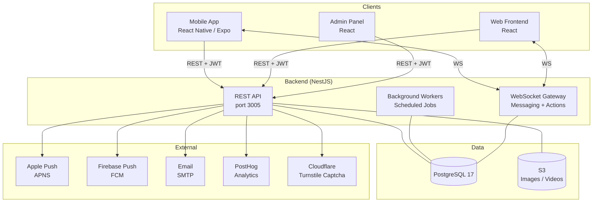

---

## 2. Package Structure

The repo is a **Bun workspace** — one `bun install` at the root hoists all dependencies into a single `node_modules`. The packages are layered by what they share with what:

- **`common/`** — the widest layer. Shared by literally everything including the server. Contains the `Result<T,E>` type, analytics event definitions, and form schema types. If it lives here, every package can use it.
- **`shared/`** — shared by the three client apps (frontend, admin, mobile) but not the server. Contains API client hooks (TanStack Query wrappers) and the auto-generated API types from OpenAPI.
- **`sharedweb/`** — shared by frontend and admin only (not mobile, because it's web-specific). Contains React components that appear identically in both the member web app and the admin panel.
- **`apps/`** — the three actual applications. They import from the layers above but never import from each other.
- **`server/`** — the NestJS backend. It imports from `common/` but has no knowledge of the client apps.

This layering means type changes flow cleanly: update a form schema type in `common/`, and both the server validation and the client-side form rendering get the same type.

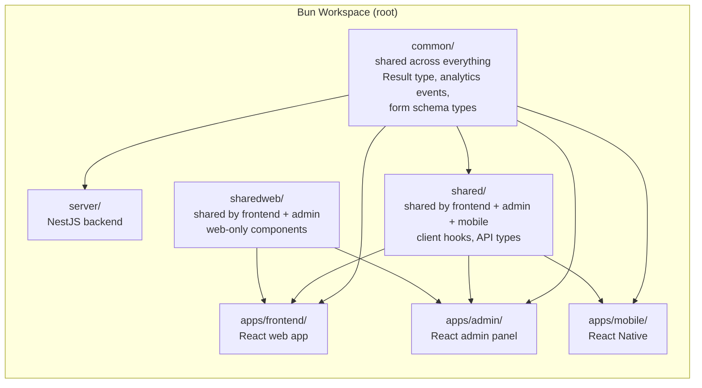

---

## 3. Auth Flow

This diagram covers the full authentication lifecycle: how a new user signs up, how subsequent requests are authenticated, how tokens get refreshed when they expire, and how password resets work.

**Key design decisions:**

- Passwords are hashed with **bcrypt** before being stored — the plaintext password never touches the database.
- There are two tokens: a short-lived **access token** (JWT, sent as a header or cookie) and a long-lived **refresh token** (stored as a cookie). This means a user stays logged in for weeks without re-entering their password, but a stolen access token has a short window of validity.
- **Cloudflare Turnstile** (an invisible captcha) is verified server-side during signup to prevent bot account creation. This was added after a bot spam incident (see git history: "add captcha for registration").
- After signup the server sends a **verification email** — the user must confirm their email address before they can fully participate.

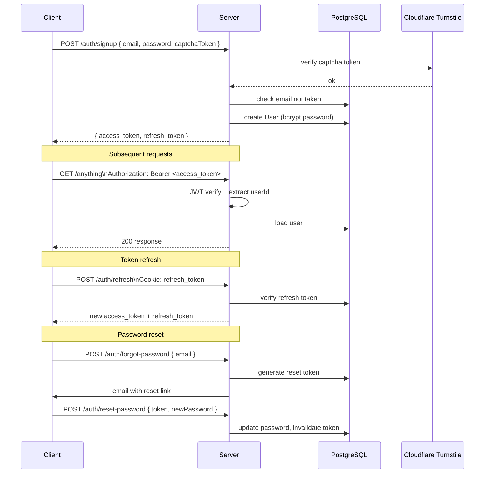

---

## 4. Core Domain Model

This is the entity-relationship (ER) diagram — the data model that everything else is built on. Understanding this is the key to understanding the whole system.

**The main entities and what they mean:**

- **User** — a member of the platform. They have a timezone, notification preferences, a `referralSource` (how they found the app), and belong to one `Cluster` (a small group used for social feed sorting).
- **Community** — the organization using Alliance (e.g. "Plant-Based Alliance"). Has a member capacity. Users can be regular members or leaders.
- **Action** — a task the org asks members to do. Has a `taskType` (Funding, Activity, or Ongoing) and a `cohortExpression` — a JSON rule that determines which members this action is visible to (e.g. "only members in group X" or "members who joined more than 3 months ago"). Actions can have a Form attached.
- **ActionActivity** — the event log of what a member did with an action. The four types are: completed, won't complete, dismissed, or submitted a follow-up form. This is how participation is tracked.
- **Contract** — a pledge document written in Markdown with a start/end date. Members sign it, and the server can auto-suspend members who don't honour it.
- **ContractEvent** — records every time a user interacted with a contract (signed, suspended, reinstated, etc.).
- **Form / FormResponse** — forms are attached to actions as the proof-of-completion mechanism. When a member completes an action, they fill out a form. `FormResponse` stores their answers alongside a snapshot of the form schema at the time of submission — this ensures old responses don't break if the form is later edited.
- **Cluster** — a small group (e.g. 10-20 people) that a user belongs to. Used to prioritise whose activity appears in your home feed.
- **Campaign** — a non-user referral source, like a QR code at an event or a partner org. New users who sign up via a campaign are attributed to it.

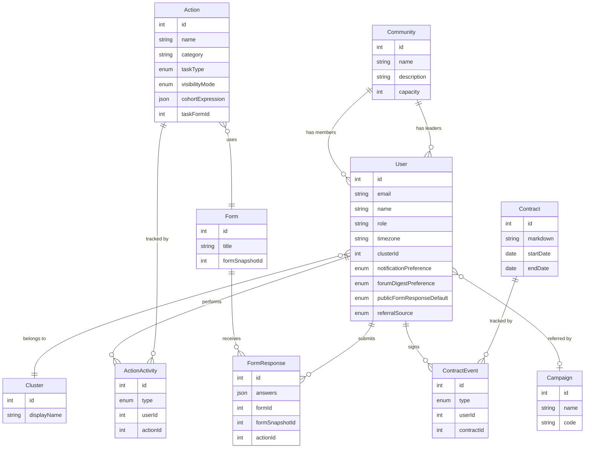

---

## 5. Action Lifecycle (Member Side)

An **Action** is the central unit of work in Alliance. This state diagram shows every state an action can be in from a single member's perspective — from first seeing it to completing or ignoring it.

**How it works step by step:**

1. An action becomes **Visible** to a member when their profile matches the action's `cohortExpression`. Not all members see all actions — the org can target actions at specific groups or tenure ranges.
2. From Visible, the member has three choices: complete it, dismiss it (swipe away, low intent), or explicitly opt out (Won't Do, higher intent rejection).
3. If the action has a form attached, completing it requires filling out that form first. The form submission and the `USER_COMPLETED` activity record are created together.
4. Some actions have a **follow-up form** — a second form shown after completion to collect additional data (e.g. "How did it go?"). This creates a separate `USER_SUBMITTED_FOLLOW_UP_FORM` activity.
5. Admins can override dismissed or opted-out states — useful if a member clicked the wrong button.

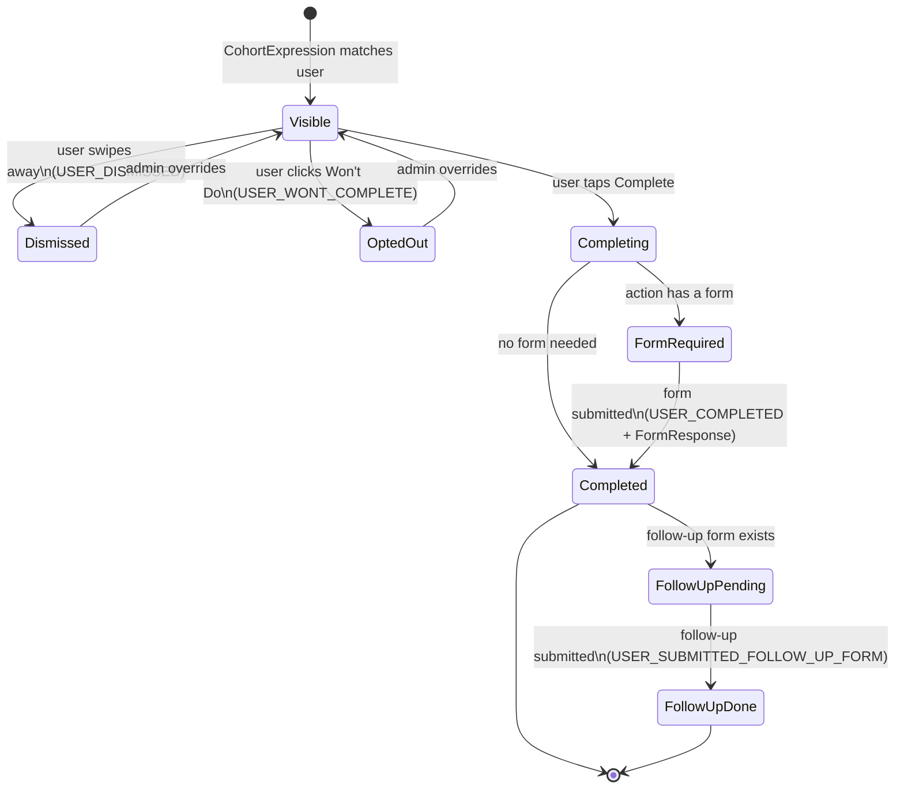

---

## 6. Action Completion Flow (End to End)

This sequence diagram zooms into what actually happens on the server when a member hits "Complete" on an action. It covers the request path, database writes, AI fraud detection, follow-up forms, and push notifications — all within a single user action.

**What happens and why:**

- The request body is a `SubmitFormDto` — NestJS validates it automatically before the controller even runs. If required fields are missing or the wrong type, it returns 400 before touching the database.
- A **FormSnapshot** is used instead of the live form schema. This means the server validates the answers against the version of the form that was shown to the user, not the current version (which might have changed since the user opened the screen).
- **AI detection** runs asynchronously to flag potentially fraudulent submissions (e.g. copy-pasted answers, suspiciously fast completions). Results are stored separately and visible in the admin panel.
- Push notifications fan out to all members who have subscribed to this action's updates.

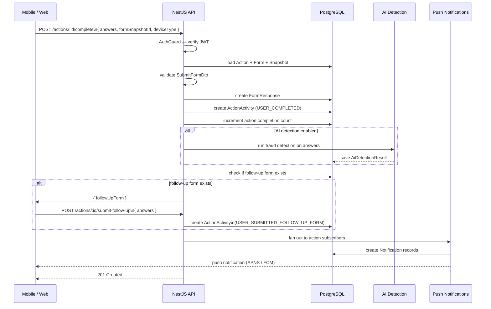

---

## 7. Notification System

Alliance sends notifications from many different triggers. This diagram shows where notifications originate, how they're routed through the notification service, and how they're delivered.

**Three paths to delivery:**

1. **Most events** go through `NotifsService.createNotif()` — a central service that creates an in-app notification record in the DB and queues a push notification via `PushModule`.
2. **Action Events** (scheduled events tied to actions) have their own dedicated worker (`ActionEventNotifWorker`) that fans out push notifications on a schedule. There's also a `ReminderService` that sends advance reminders before an action event starts.
3. **In-app notifications** are stored in the database and shown in the notifications tab inside the app. Push notifications go to APNS (iOS) or FCM (Android) to wake the device.

The key insight: `PushModule` is the single exit point for all device pushes — it decides whether to use APNS or FCM based on the device's platform.

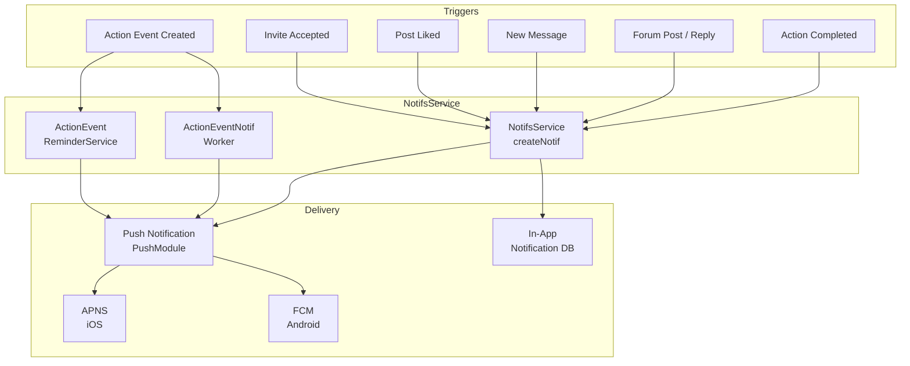

---

## 8. Messaging (Real-Time)

The messaging feature uses **WebSockets** rather than REST because messages need to appear instantly without the client polling. This sequence shows a message being sent from User A to User B in real time.

**How it works:**

- Both users connect to the WebSocket gateway when the app opens, authenticating with their JWT token on the initial handshake.
- When User A sends a message, it goes to the gateway which calls `ConversationService` to persist it. The service writes to the database first (so messages survive if either party disconnects), then the gateway broadcasts the message to all connected participants in that conversation.
- User B receives the message instantly if they're online. If they're offline, a push notification is sent via `message-push.listener.ts` (a separate event listener that watches for new message events).
- There's a separate `MessagingOverviewGateway` that maintains unread counts — this powers the badge on the messages tab without the client having to fetch conversation details.

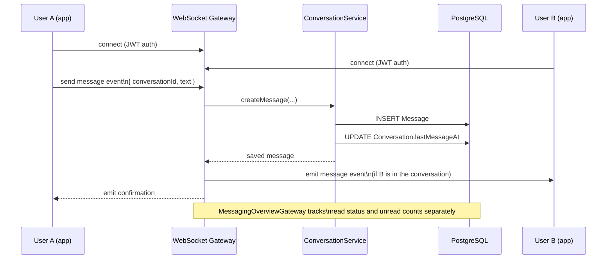

---

## 9. Campaign / Referral Attribution

Alliance tracks exactly how every new member found the platform. This matters for org growth — knowing whether new members come from a QR code at an event, a personal invite from an existing member, or a link shared from a specific action helps the org understand what's working.

**The four referral surfaces:**

1. **Campaign** — a `Campaign` entity with a unique `code`. Used for marketing (QR codes at events, partner org links). The new user is attributed to the campaign, not any individual person.
2. **Personal referral** — a user shares their personal invite link. The new user is attributed to them as `referredBy`.
3. **One-time invite** — an admin-generated token, single use. Good for controlled onboarding.
4. **Action share link** — a user shares a specific action. The new user who signs up through that link is attributed to the action's share URL.

All paths converge at signup where the server records the `referralSource` enum on the User record and fires a PostHog event. This feeds the admin panel's acquisition analytics.

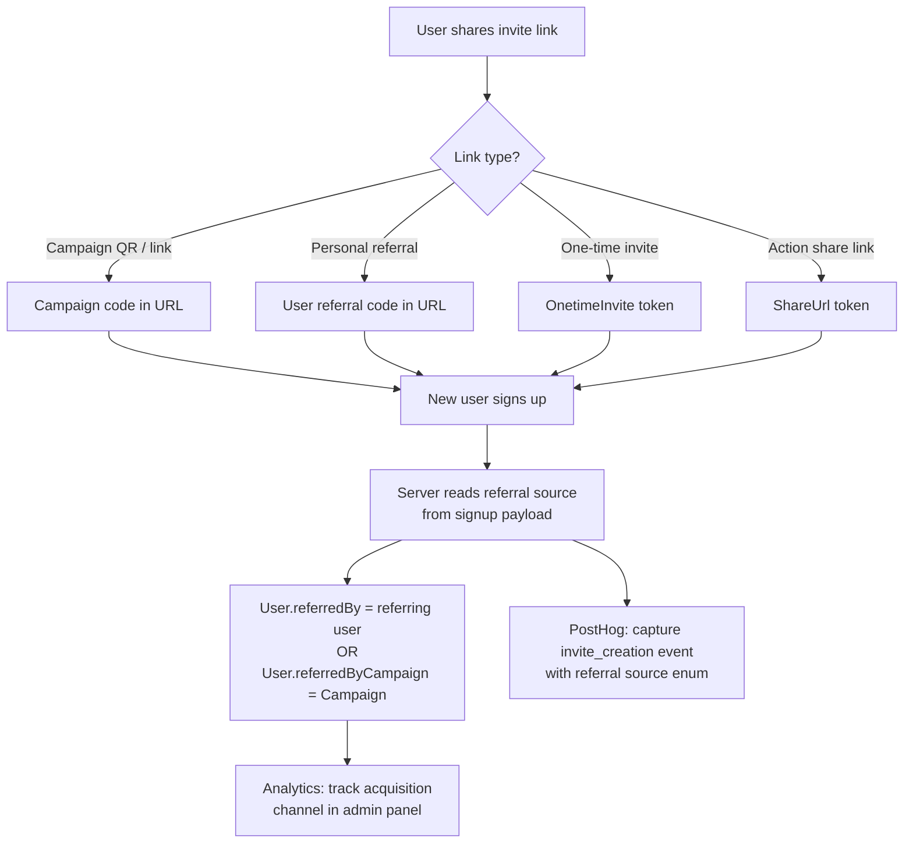

---

## 10. Background Workers

Not everything in Alliance is triggered by a user action. Some things need to happen automatically on a schedule — sending reminders before a deadline, suspending members who violated a contract, or cleaning up stale data. These are **background workers** that run inside the NestJS process using `@nestjs/schedule`.

**The five workers and what they do:**

- **ContractReminderWorker** — scans contracts with upcoming deadlines and sends reminder notifications to members who haven't yet signed. Runs on a cron schedule so reminders go out at the right time, not just when someone opens the app.
- **ContractSuspenderWorker** — after a contract's end date, checks which members violated the terms (e.g. didn't sign, or signed but didn't complete required actions) and marks their account as suspended. This is how the platform enforces accountability commitments.
- **ForumActionCompleterWorker** — some actions are designed to be "completed" by posting in the forum. This worker detects when a member has made a qualifying forum post and auto-creates the `USER_COMPLETED` activity for them.
- **ReloadUsersJoinedWorker** — recalculates membership counts for communities periodically. This keeps the capacity gauges in the admin panel accurate without requiring a live count query on every page load.
- **ActionEventNotifWorker** — for scheduled action events (e.g. "Webinar on Tuesday at 7pm"), this worker fans out push notifications at the scheduled time. Works alongside the `ActionEventReminderService` which sends advance reminders (e.g. 1 hour before).

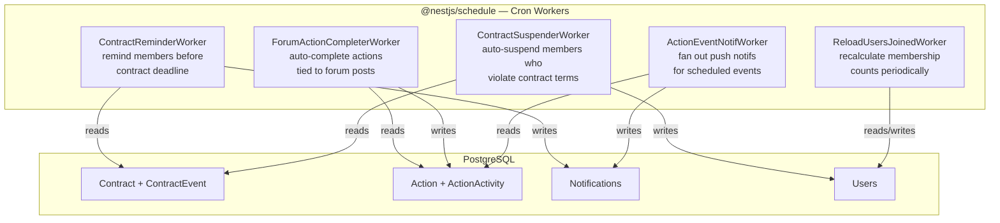

---

## 11. Analytics Pipeline

The admin panel has an analytics section that helps org leaders understand member behaviour. All of it is computed on the fly from raw PostgreSQL tables — there's no separate analytics database or data warehouse. The `AnalyticsService` runs aggregate queries when the admin panel requests them.

**What each metric measures:**

- **AggregateStats** — overall numbers: total action completions, active member count. The "headline" stats on the dashboard.
- **TimeToChurn** — how long after joining does a member go inactive? Helps the org understand if they're losing people early (onboarding problem) or later (engagement problem).
- **MemberCompletionRetention** — for a given cohort of members (e.g. "everyone who joined in January"), what fraction are still completing actions week over week? Shows if members are staying engaged over time.
- **ActionCompletionCurve** — for a given action, when during the action's lifespan do completions happen? Do members rush to complete it in the first week or spread out over months? Helps admins time their reminders.
- **ContractStatusHistory** — how the overall contract signing rate has changed over time. Shows whether a push to get members to sign the contract actually worked.

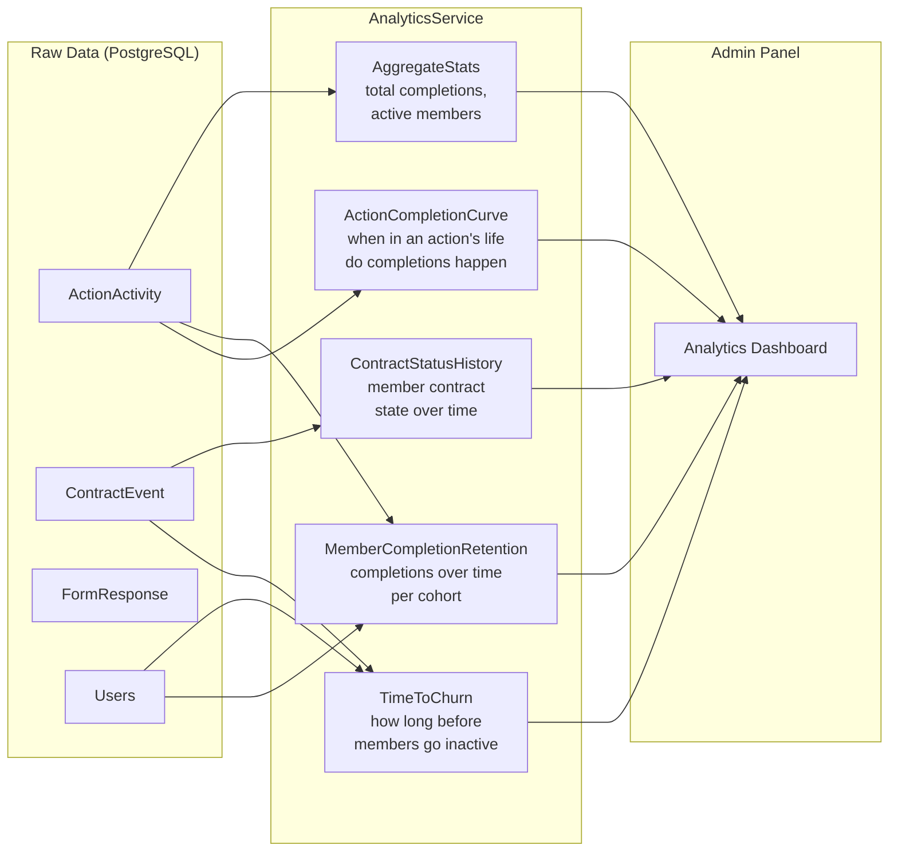

---

## 12. Git History — Feature Evolution

This timeline was reconstructed from the git log (4,561 total commits). It shows the order in which major features were built, which reveals the product's priorities at each stage.

**What the history tells you:**

- The platform started as a pure action-tracking tool (auth + actions + contracts). The social features (forum, friends, likes, feed) came later — they were added to increase engagement and retention.
- The **cluster system** is notable: users are grouped into small clusters so the home feed can show you activity from people like you, not just a firehose of the whole org. This was added after the basic feed to improve relevance.
- **Cohort expressions** (smart targeting for actions) came after the basic action system worked — first they proved the concept with everyone seeing all actions, then added targeting.
- The **campaign system** was added to support paid/partner acquisition channels alongside word-of-mouth. The `referralSource` enum was refined over time as more channel types were added.
- Infrastructure work (Bun migration, OTA mobile updates, captcha) happened throughout but is clustered in the middle of the history — after the product was proven but before it was fully scaled.
- Recent work is mostly **polish and tooling**: centralised query keys, better TypeScript types, the `Result` type utility, away ranges, and admin-side push notifications.

```mermaid
timeline
    title Key Features Added (git history)

    section Early Foundation
        Initial : Auth (JWT + bcrypt)
                : Communities + Users
                : Actions + Forms
                : Contract signing

    section Social Layer
        Forum posts + replies : Forum
        Friend system : Friends
        Groups / subgroups : Communities subgroups
        Likes on posts : Forum likes
        Activity tab on profiles : User profiles

    section Targeting + Smart Features
        Cohort expressions : Action targeting by group/tag
        Cluster system : Users grouped into clusters\nfor social sorting in feed
        Platform tenure cohort : Target by how long a member has been on the platform

    section Feed + Discovery
        Home feed : Self + friend + cluster activity
        Action references + hover previews : Rich action links in posts
        Search : Member and content search

    section Growth + Acquisition
        Campaign system : QR codes + marketing campaigns\nattributed to new signups
        One-time invites : Single-use invite links
        Share links : Action-specific share URLs
        Referral source enum : Track where new members come from

    section Analytics
        Aggregate stats : Completion counts, active members
        N-week churn : How long before inactivity
        Action completion curve : When completions happen in action lifecycle
        Member completion retention : Cohort retention over time

    section Infrastructure
        Bun migration : Replaced npm with Bun workspace
        OTA updates : Mobile over-the-air updates
        Captcha : Cloudflare Turnstile on signup
        Rate limiting : IP-based throttle on auth endpoints
        Result type : common/result.ts for typed error handling
        Centralised TanStack queryKeys : Shared API query key registry

    section Recent Polish
        Push from admin panel : Admins can push to individual members
        Away ranges : Members can mark themselves away
        Tags admin : Admin can manage member tags
        AI detection : Fraud detection on form submissions
        Form snapshots : Versioned form schemas for historical responses
```

---

## 13. Request Lifecycle (NestJS)

Every HTTP request to the Alliance backend goes through the same pipeline before reaching business logic. This diagram shows that pipeline in order, including where and why requests get rejected early.

**Each step explained:**

1. **ThrottlerGuard** — rate limiting runs first, before auth. This protects against brute-force attacks on the login and signup endpoints specifically (configured with separate throttle limits per IP).
2. **Auth decorator** — the route's decorator determines what auth check happens:
   - `@Public` — no auth needed (login, signup, public action share pages)
   - `@AuthGuard` — any logged-in member (most endpoints)
   - `@AdminGuard` — must be an admin user (admin panel endpoints)
   - `@CommunityLeaderGuard` — must be a community leader
3. **ValidationPipe** — NestJS automatically validates the incoming request body against the DTO class. It checks types, required fields, enum values, and array constraints using `class-validator` decorators. Invalid requests are rejected here with a 400 before any database calls happen.
4. **Controller → Service → DB** — the actual business logic. The controller receives a validated, typed DTO object. The service does the database work via TypeORM.
5. **Response DTO** — the service returns a database entity, but the controller constructs a response DTO from it before sending. This controls exactly which fields go to the client — internal fields like password hashes are never included.

```mermaid
flowchart TD
    REQ[Incoming HTTP Request]

    REQ --> TH[ThrottlerGuard\nrate limiting]
    TH --> AUTH{Auth decorator?}

    AUTH -->|@Public| CTRL
    AUTH -->|@AuthGuard| JWT[JWT verify\nextract userId]
    AUTH -->|@AdminGuard| ADMIN[JWT verify\n+ check isAdmin flag]
    AUTH -->|@CommunityLeaderGuard| LEAD[JWT verify\n+ check community leader]

    JWT --> PIPE
    ADMIN --> PIPE
    LEAD --> PIPE

    PIPE[ValidationPipe\nvalidate + transform DTO]
    PIPE --> CTRL[Controller method]
    CTRL --> SVC[Service]
    SVC --> DB[(PostgreSQL\nvia TypeORM)]
    SVC --> DTO[construct response DTO]
    DTO --> RES[HTTP Response]

    PIPE -->|invalid| ERR[400 Bad Request]
    JWT -->|invalid| ERR401[401 Unauthorized]
    ADMIN -->|not admin| ERR401
```
