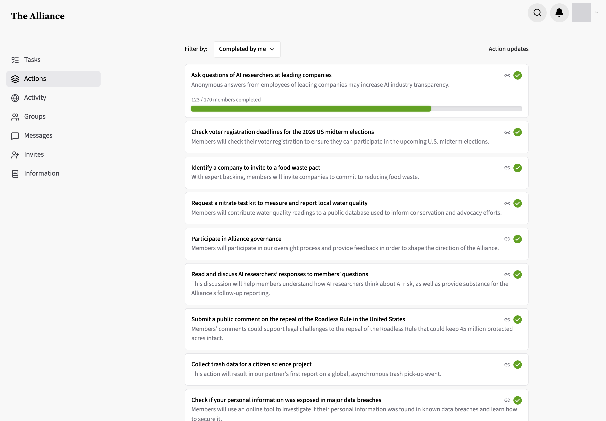
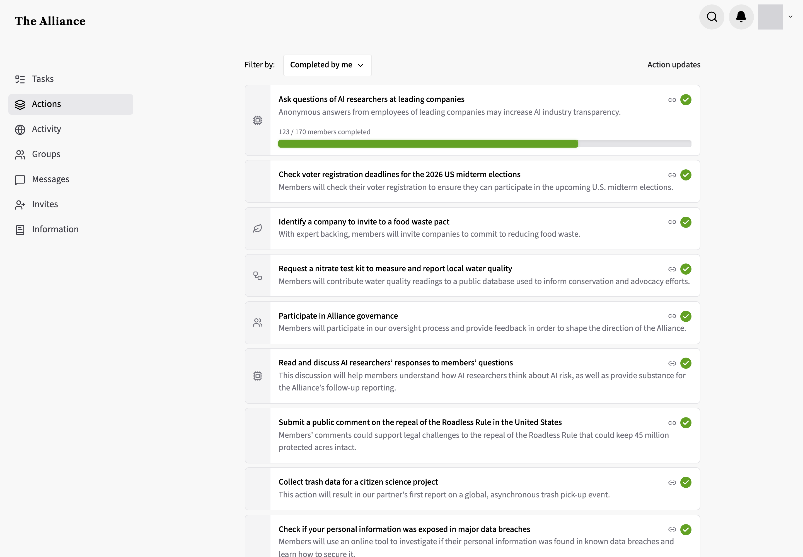
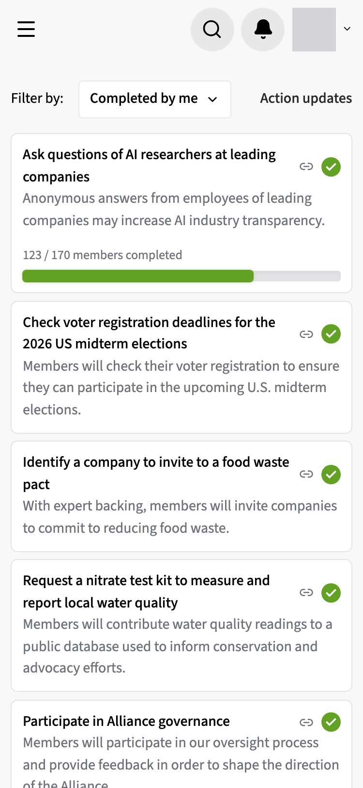
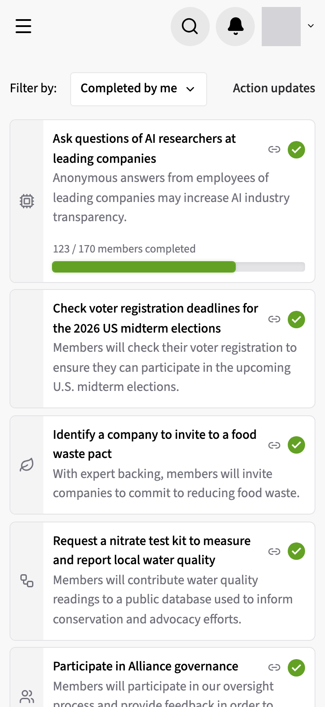

# Category icons on the actions list

**Status:** built · **Branch:** `design/action-category-icons` · **Base:** `main` · **Running:** `default`

## Request

On `/actions`, show each action's category. With one category, use the admin panel's icon for it. With several, use one icon that represents "interwoven".

## Findings

- `ActionCategory` (`server/src/actions/action-category.ts`): meta, environment, poverty, democracy, technology. `action.category` is an array on `ActionDto`.
- Admin icons and labels in `apps/admin/src/components/ActionCategoryIcons.tsx` (`ACTION_CATEGORY_DISPLAY`: Leaf, HandCoins, Landmark, Cpu, Users). To share with the frontend it moves to `sharedweb`.
- Card: `apps/frontend/src/components/ActionItemCard.tsx`, also used outside `/actions`.
- Local db, non-archived: 25 of 89 actions have no category, 57 one, 7 several. Usage: meta 31, environment 21, poverty 11, technology 11, democracy 9.

## Decisions

- **Several categories**: lucide `Workflow` icon, tooltip listing the categories. _User._
- **Placement**: a left gutter before the action name, slightly dimmed grey background, icon centered. The gutter is present with no category too, so all text aligns. _User._
- **Where it appears**: every use of `ActionItemCard`, not only `/actions`. _Agent: accepted recommendation; one component, no extra prop._
- **Icon mapping**: moves from `apps/admin` to `sharedweb`, used by both. _User._
- **Shared module**: `sharedweb/lib/actionCategory.ts` exports `ACTION_CATEGORY_DISPLAY`, `ACTION_CATEGORIES`, and `sortActionCategories`; the admin's `ActionCategoryIcons` and `ActionCategoryPicker` stay in admin and import them. _Agent: only the data is shared; the admin components have no frontend caller._
- **Gutter**: `w-10` (`md:w-12`) column, `bg-zinc-100`, `rounded-l-[6px]` to sit inside the card's 7px radius and 1px border, spanning the card's full height including the completed bar; the card's padding moves to the content column. Icon 18px, `text-zinc-500`, centered vertically. _Agent: zinc-100 reads as dimmed against the white card at both widths; full height keeps the completed bar aligned with the text._
- **Tooltip**: one label per line; `aria-label` joins them with ", ", in the admin's category order. Only the icon sits above the card's full-card link, so the rest of the gutter still opens the action. _Agent: keeps the whole card clickable while the icon stays hoverable._
- **Mobile app**: not changed; the request covers the web card only. _Agent: flagging for parity._

## Screenshot data

The worktree db (`alliance_action_category_icons`) was edited so one view shows every case, for before and after alike: action 157 category `{environment}` → `{environment,technology}` (multi), and action 146's `office_action` event moved from 2026-08-11 to 2026-12-31 so it is `member_action` and shows the completed bar. Views are `/actions` as a non-admin member, default "Completed by me" filter, top of page; the header avatar is masked.

## Variants

- **`default`**: category gutter on `ActionItemCard`; shared icon mapping in `sharedweb`. [patch](variants/default/change.patch)

## Media

| View            | before                      | default                                |
| --------------- | --------------------------- | -------------------------------------- |
| `/actions` 1440 |  |  |
| `/actions` 375  |   |   |
