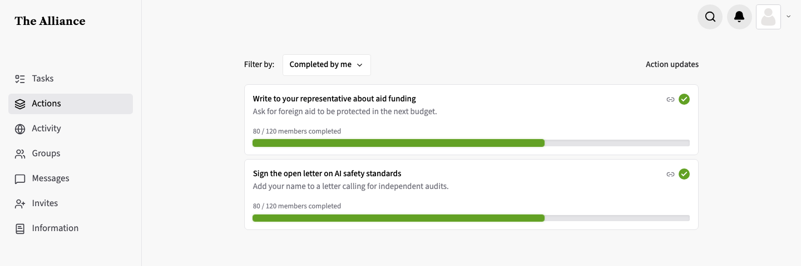
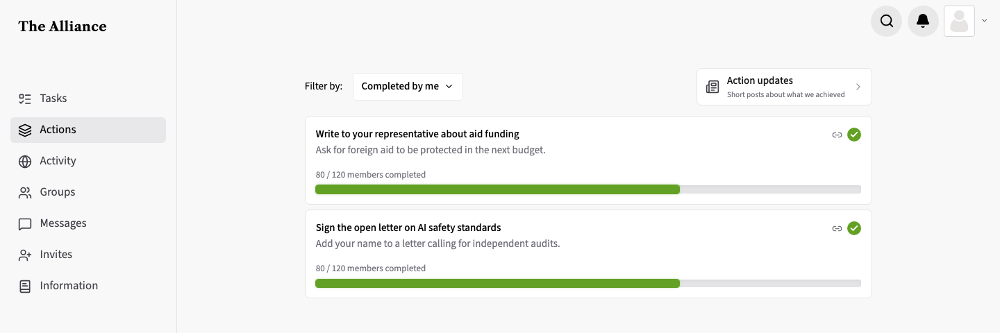
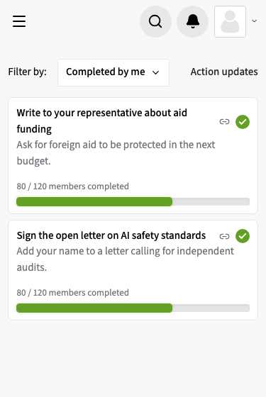
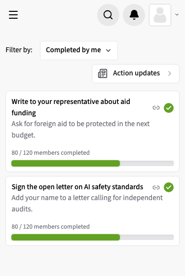
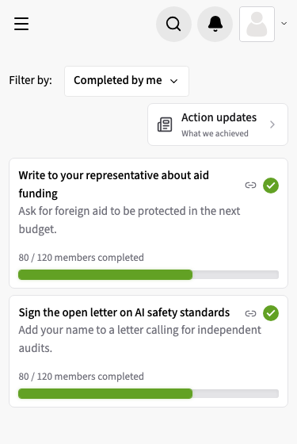

# Action updates link reads as a button

**Status:** built · **Branch:** `design/action-updates-link` · **Base:** `main` · **Running:** `short-caption`

## Request

On `/actions`, "Action Updates" is plain text and doesn't read as a button. Make it clearly a button, with small text below describing the section: "Short posts about what we achieved".

## Findings

- `apps/frontend/src/pages/app/ActionsListPage.tsx`: a `Link` to `/action-updates` styled `text-zinc-800 hover:underline font-medium`, right-aligned beside the filter dropdown.
- Mobile `apps/mobile/app/(app)/actions/index.tsx` has its own actions list; not in the request.

## Decisions

- **Button style**: bordered white card-button on the right, lucide `Newspaper` icon, title "Action updates", small grey caption "Short posts about what we achieved" underneath. _User._
- **Narrow screens**: try both removing and shortening the text; screenshot each at 375 wide. _User._
- **Running variant**: `short-caption`. _Agent: keeps the description the request asked for on every width._
- **Narrow layout**: the filter row wraps (`flex-wrap`) and the button keeps `ml-auto`, so below ~560px it drops to its own line, right-aligned; no horizontal overflow from 320 to 1440. _Agent: filter + dropdown + button don't fit in 343px even without the caption, and wrapping keeps each control full-size._
- **Card style**: `bg-white border-zinc-200 rounded-[7px]` like `ActionItemCard`, so it reads as the same family as the cards below it; `ChevronRight` as the affordance, as in `HomeUpdatesRow`. _Agent: matches existing card and link-row patterns._
- **Screenshots**: rendered with Playwright against the worktree frontend with the API mocked by synthetic data (user "Sam Example", made-up actions). _Agent: minting a session token from `JWT_SECRET` was blocked, and mocking also keeps real member data out of the media._

## Variants

- **`hide-caption`**: card-button as above; below `md` the caption is hidden, leaving icon + title. [patch](variants/hide-caption/change.patch)
- **`short-caption`**: card-button as above; below `md` the caption shortens to "What we achieved". [patch](variants/short-caption/change.patch)

## Media

| Width | before | hide-caption | short-caption |
| --- | --- | --- | --- |
| 1440 |  |  |  |
| 375 |  |  |  |
