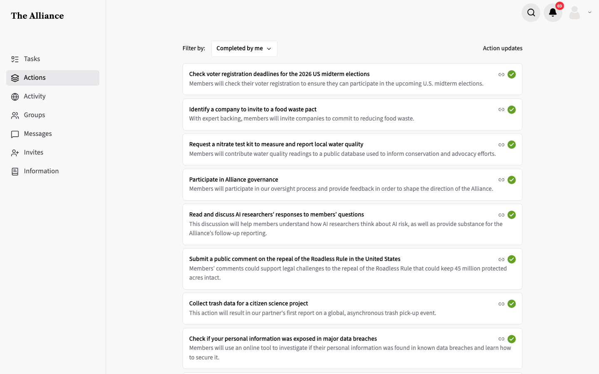
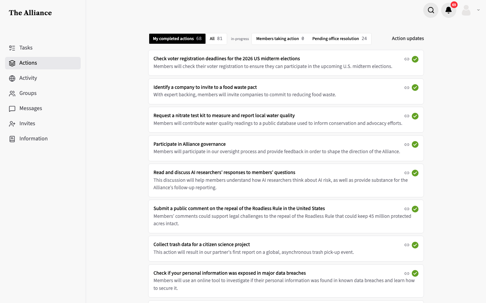
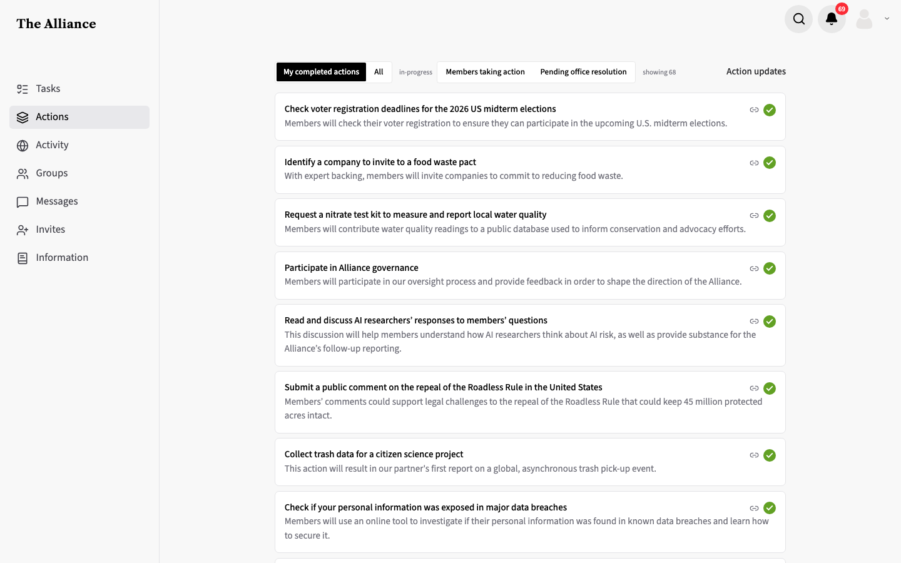
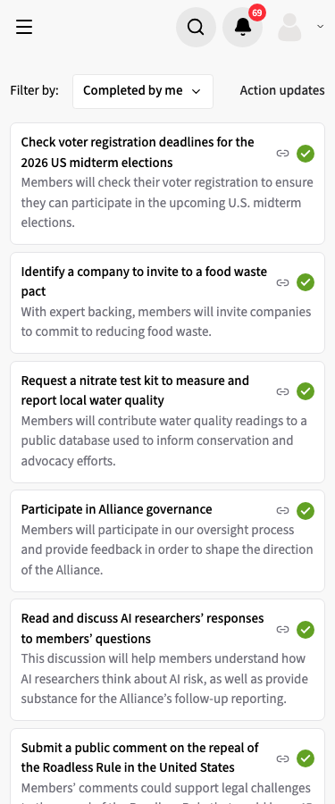
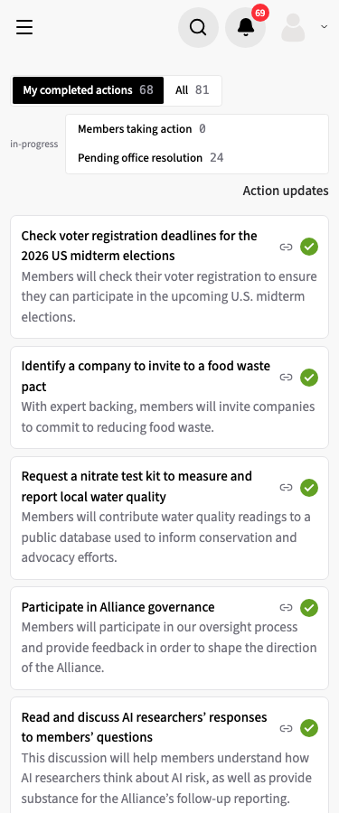
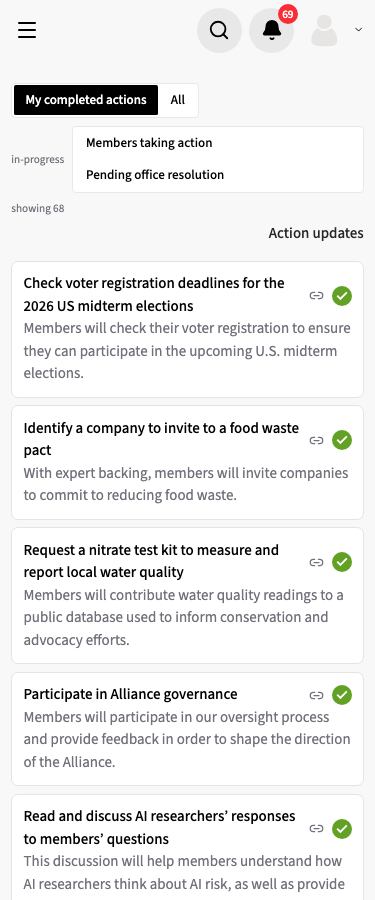
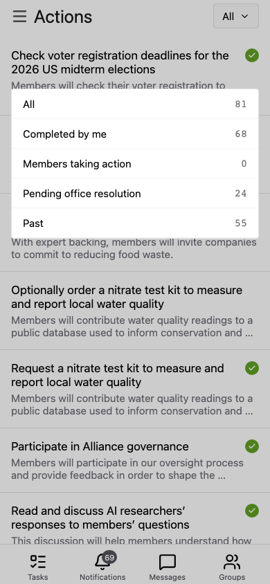
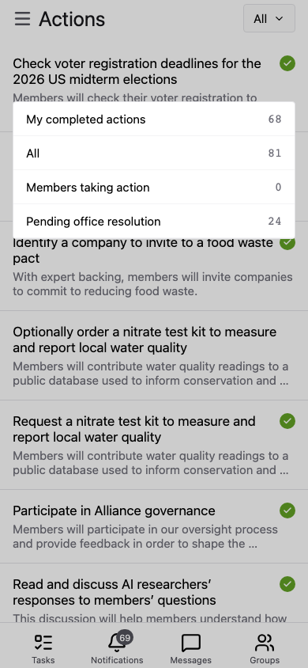

# Segmented filter replaces the "Filter by" dropdown

**Status:** built · **Branch:** `design/actions-filter-tabs` · **Base:** `main` · **Running:** `count-selected`

## Request

On `/actions`, replace the "Filter by" dropdown (All 87, Completed by me 15, Members taking action 3, Pending office resolution 24, Past 56; defaults to Completed by me) with a radio button group:
`[ my completed actions | all ] in-progress [ members taking action | pending office resolution ]`.
Two versions: counts inside each button, and counts only for the selected option at the end of the bar (`showing 15`).

## Findings

- `apps/frontend/src/pages/app/ActionsListPage.tsx` renders `DropdownSelect` over `FilterMode` (`shared/lib/actionUtils.ts`); `filterActions` in `shared/lib/actionsListPage.ts`. Default is Completed by me when non-empty, else All.
- Mobile `apps/mobile/app/(app)/actions/index.tsx` uses the same `FilterMode` with its own dropdown, default All.
- Local db (non-archived, by current status): office_action 24, member_action 2, completed 58, no status 5. Past = 58, the largest bucket, and it's absent from the proposed bar.
- Longest action name 92 chars.

## Decisions

- **Past option**: dropped. "All" already includes past actions; no need seen for a past-only view. _User._
- **Default**: "my completed actions" when non-empty, else "all", as today. _User._
- **"in-progress"**: small grey, non-interactive label before the second group. _User._
- **Narrow screens**: groups wrap to separate lines; no horizontal scroll. _User._
- **Mobile app**: its dropdown takes the same four options and labels. _User._ It keeps its current default (All) and its counts. _Agent: the request only changes the options._
- **Running variant**: `count-selected`. _User._
- **Control**: native radios, visually hidden, inside labels styled as segments, in `apps/frontend/src/components/ActionsFilterBar.tsx`. One `name` across both groups gives arrow-key movement through all four options and a single `role="radiogroup"` ("Filter actions"). _Agent: `sharedweb/ui` has no segmented or radio-group control; `YesNoToggle` is an `aria-pressed` button pair, not a radio group, so nothing fit to reuse._
- **Group membership**: a `Record<FilterMode, boolean>` puts each mode in the first or the "in-progress" group, so a new `FilterMode` fails the build until it is placed. The in-progress radios take the label as `aria-describedby`. _Agent: AGENTS.md enum-branching rule; the label is otherwise lost to screen readers._
- **Look**: white bordered track with black selected segment, matching `YesNoToggle`'s selected/unselected colours and the dropdown's border. _Agent: closest existing toggle style._
- **Enum order**: `FilterMode` is reordered to the bar's order (My completed actions, All, Members taking action, Pending office resolution), so the mobile dropdown lists the options in the same order as web. _Agent._
- **Narrow screens**: the in-progress track wraps its two segments onto separate rows at 375px (the two labels don't fit side by side), and "Action updates" wraps below the bar, right-aligned. No horizontal scroll. _Agent._
- **Counts after a failed load**: omitted in both variants, as the dropdown did; `ActionsListPage.test.tsx` asserts no "showing" text on failure in `count-selected`. _Agent._

## Variants

- **`counts-in-buttons`**: each segment shows its count. [patch](variants/counts-in-buttons/change.patch)
- **`count-selected`**: segments carry no counts; the bar ends with "showing N" for the selected option. [patch](variants/count-selected/change.patch)

## Media

| View                             | Before                                 | `counts-in-buttons`                                         | `count-selected`                                         |
| -------------------------------- | -------------------------------------- | ----------------------------------------------------------- | -------------------------------------------------------- |
| Web `/actions`, 1440px           |             |             |             |
| Web `/actions`, 375px            |              |              |              |
| Mobile app, filter dropdown open |  |  |  |

Captured as a seeded member with 68 completed actions (avatar replaced with the default icon). The mobile app is the Expo web build at 390px; its dropdown is the same in both variants.
